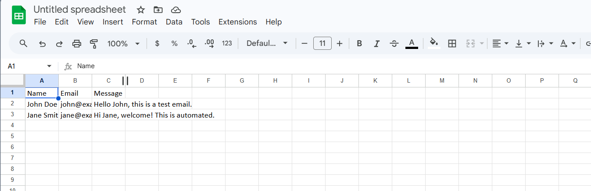
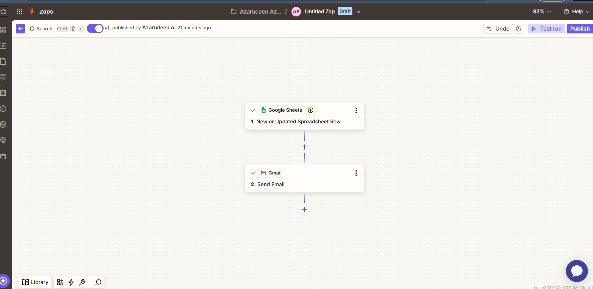
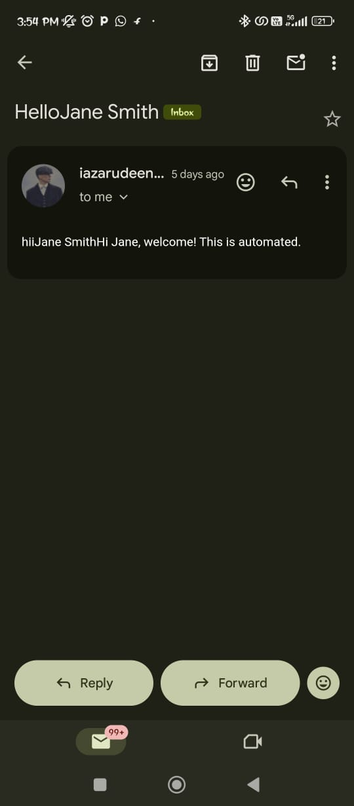

  📧 Email Automation System using Zapier

 📌 Overview
 This project demonstrates a no-code automation workflow built using Zapier, Google Sheets, and Gmail.
 The system automatically sends emails when new data is added to a Google Sheet, reducing manual effort and improving workflow efficiency.

⚙️ Workflow
🟢 Input (Google Sheets)
Data is entered into a Google Sheet (such as name, email, message, or request details).

🔵 Automation (Zapier Trigger)
Zapier detects a new row in the Google Sheet and triggers the automation workflow.

🔴 Output (Gmail)
An automated email is generated and sent to the specified recipient using Gmail.

🔄 Workflow Diagram
Google Sheets → Zapier Trigger → Gmail → Email Sent

🧰 Tools Used
Google Sheets
Zapier (Automation Tool)
Gmail (Email Service)

✨ Key Features
Fully automated email sending system
Trigger-based workflow (no manual action needed)
Real-time processing of new data entries
Reduces repetitive manual email tasks

## Workflow Explanation

### 1. Input Data (Google Sheets)

### 2. Automation Workflow (Zapier)

### 3. Final Output (Result)

